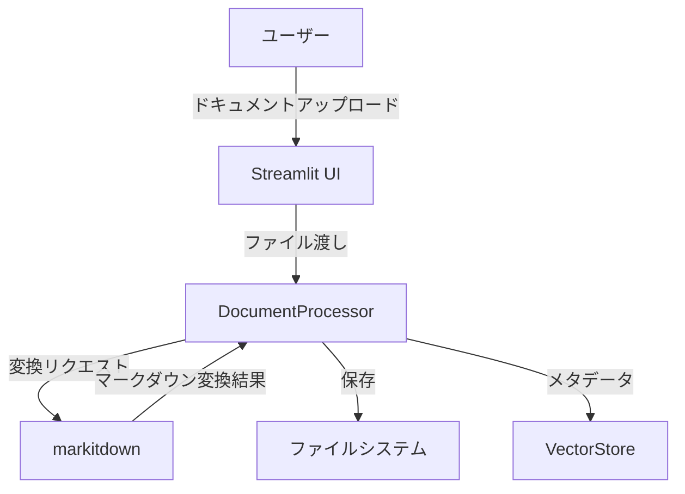
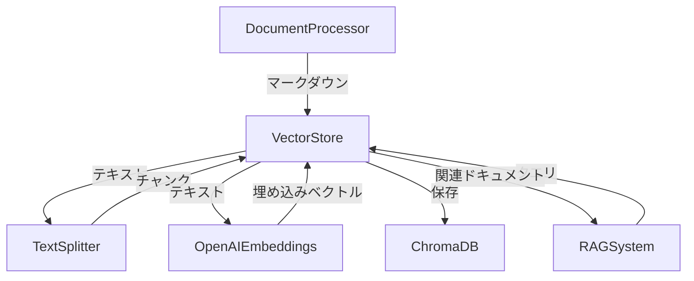
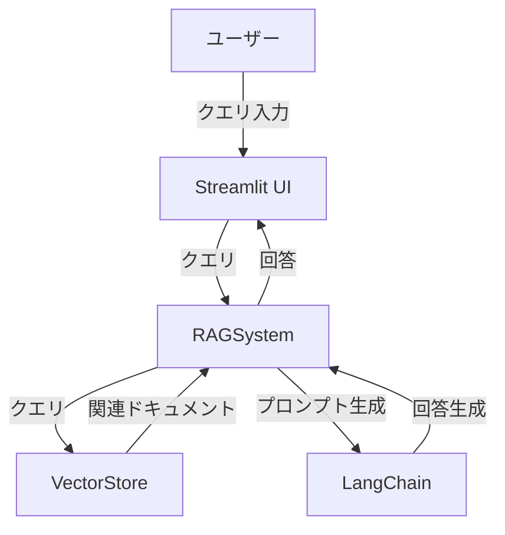
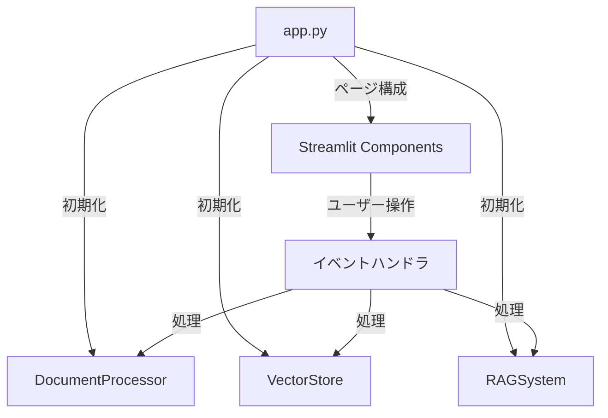

# システムパターン

## アーキテクチャ概要

このプロジェクトは、以下の主要コンポーネントで構成される階層型アーキテクチャを採用します：

```
[ユーザー] <-> [Streamlit UI] <-> [コアロジック] <-> [データストア]
```

## コンポーネント構成

### 1. ドキュメント処理サブシステム



**主要クラス**:
- `DocumentProcessor`: ドキュメント変換と保存を担当
  - 責務: ファイル受け取り、markitdownへの受け渡し、結果の保存
  - インターフェース: `convert_file()`, `save_markdown()`, `process_document()`

### 2. ベクトルデータベースサブシステム



**主要クラス**:
- `VectorStore`: ベクトルデータベース操作を担当
  - 責務: ドキュメントのチャンク分割、埋め込み生成、保存、検索
  - インターフェース: `add_document()`, `search()`, `persist()`

### 3. RAGサブシステム



**主要クラス**:
- `RAGSystem`: RAG機能を担当
  - 責務: クエリ処理、コンテキスト取得、回答生成
  - インターフェース: `query()`

### 4. UIサブシステム



**主要コンポーネント**:
- `app.py`: Streamlitアプリケーションのエントリーポイント
  - 責務: UI構築、コンポーネント初期化、イベント処理
  - 主要機能: ドキュメントアップロード、処理状態表示、検索インターフェース

## データフロー

### ドキュメント処理フロー

1. ユーザーがStreamlit UIを通じてドキュメントをアップロード
2. `DocumentProcessor`がファイルを受け取り、markitdownを使用してマークダウンに変換
3. 変換されたマークダウンがファイルシステムに保存
4. `VectorStore`がマークダウンを受け取り、チャンク分割
5. 各チャンクがOpenAI埋め込みモデルによってベクトル化
6. 埋め込みベクトルとメタデータがChromaDBに保存

### クエリ処理フロー

1. ユーザーがStreamlit UIを通じてクエリを入力
2. `RAGSystem`がクエリを受け取り、`VectorStore`に転送
3. `VectorStore`がクエリの埋め込みを生成し、類似度の高いドキュメントチャンクを検索
4. 検索結果が`RAGSystem`に返され、コンテキストとして使用
5. LangChainを使用してプロンプトが生成され、回答が作成
6. 回答がStreamlit UIに表示

## 設計パターン

### 1. 依存性注入パターン

コンポーネント間の結合度を低減するために、依存性注入パターンを採用します。

```python
class RAGSystem:
    def __init__(self, vector_store: VectorStore):
        self.vector_store = vector_store
        # ...
```

### 2. ファクトリーパターン

複雑なオブジェクトの生成を抽象化するために、ファクトリーパターンを採用します。

```python
@st.cache_resource
def initialize_components():
    doc_processor = DocumentProcessor()
    vector_store = VectorStore()
    rag_system = RAGSystem(vector_store)
    return doc_processor, vector_store, rag_system
```

### 3. ストラテジーパターン

異なる埋め込みモデルやテキスト分割方法を柔軟に切り替えるために、ストラテジーパターンを採用します。

```python
class VectorStore:
    def __init__(self, 
                 embedding_model=OpenAIEmbeddings(),
                 text_splitter=MarkdownTextSplitter()):
        self.embedding_model = embedding_model
        self.text_splitter = text_splitter
        # ...
```

### 4. オブザーバーパターン

処理の進捗状況をUIに通知するために、オブザーバーパターンを採用します。

```python
class ProcessingCallback:
    def on_progress(self, progress: float, status: str):
        # UIに進捗を通知
        pass
```

## 技術的決定

1. **Streamlitの採用理由**
   - Pythonベースで開発が容易
   - データサイエンス/AI向けのコンポーネントが充実
   - バックエンドとフロントエンドを統合できる

2. **LangChainの採用理由**
   - RAG機能の実装を簡素化
   - 様々なLLMとベクトルストアとの統合が容易
   - プロンプトエンジニアリングのサポート

3. **ChromaDBの採用理由**
   - Pythonとの統合が容易
   - ローカル環境での実行が可能
   - 埋め込みベクトルの効率的な保存と検索

4. **OpenAI埋め込みモデルの採用理由**
   - 高品質な埋め込みベクトルを生成
   - 多言語サポート
   - LangChainとの統合が容易
